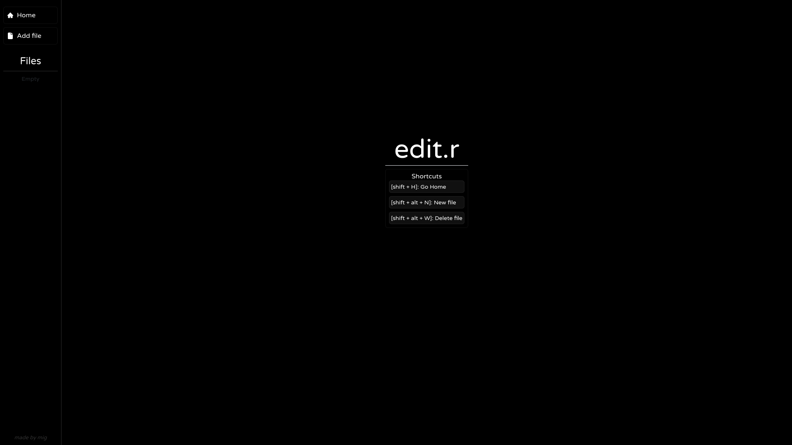

# 📝 Edit.r



Welcome to Edit.r, your go-to solution for a simple, fast, and organized code editor. Our platform empowers users to decode, debug errors, and view the output of their code seamlessly.

With Edit.r, coding becomes a breeze. Say goodbye to cumbersome interfaces and hello to efficient coding experiences. Whether you're a seasoned developer or just starting your coding journey, Edit.r is designed to cater to your needs.

Get ready to dive into a world of coding excellence with Edit.r. Let's write, debug, and create together!

## 🤖 Technologies

- **Tailwind:** A utility-first CSS framework for creating custom designs quickly.
- **Next.js 14:** A React framework that enables server-side rendering and generating static websites for React-based web applications.
- **Piston API:** A powerful code execution and compilation API.

# 🧪 Test it
You can access the project on Vercel [here](https://edit-r.vercel.app/).

# ⚙️ Instalation
If you wan't to have the project in your machine:

```
git clone https://github.com/valb-mig/edit.r
```

- Pnpm

```
pnpm install
pnpm run dev
```
